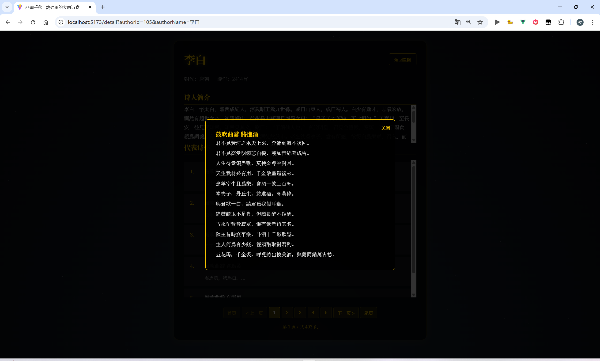

# 唐诗可视化

本项目旨在通过数据可视化的方式展示唐诗的魅力，帮助用户更直观地了解唐诗的内容和结构。

## 演示

在线演示：[https://poem.ganxy03.cn/](https://poem.ganxy03.cn/)  
在线演示：[https://poem-win.ganxy03.cn/](https://poem-win.ganxy03.cn/)

`服务器性能有限 在线演示延迟相当长 请耐心等待`

<div class="image-row">
    
    
</div>
<div class="image-row">
    
    
</div>
<div class="image-row">
    
    
</div>
<div class="image-row">
    
    
</div>

<style>
    .image-row {
        display: flex;
        justify-content: space-between;
        margin-bottom: 20px;
    }
    .image-row img {
        width: 48%; /* 每张图片占行宽的48%，留出2%的间隔 */
    }
</style>


## 功能特性
- 唐诗数据的可视化展示
- 支持按主题、作者、时间等维度筛选
- 提供交互式图表和统计分析
- 后端支持基于 Go 的服务

## 项目结构
```tree
/project-root
├── /poet-ui/      # 前端目录
│   ├── /src/         # 源代码目录
│   ├── /public/      # 公共资源目录
│   ├── index.html    # 前端入口文件
│   ├── package.json  # 项目依赖配置
│   └── vite.config.js # Vite 配置文件
├── /go/           # 后端目录
│   ├── main.go       # Go 项目入口
│   ├── app.py        # 辅助脚本
│   ├── tang_poetry.db # 数据库文件
│   ├── go.mod        # Go 模块配置
│   ├── go.sum        # Go 依赖锁定文件
│   └── /docs/        # 文档目录
│       └── API.md    # API 文档
├── /全唐诗/        # 唐诗数据目录
└── Readme.md       # 项目说明
```

## 快速开始

### 前端启动
1. 克隆项目到本地：
    ```bash
    git clone git@github.com:Qisky233/PDFAnalyst.git
    cd tangPoet
    ```
2. 安装依赖：
    ```bash
    npm install
    ```
3. 启动前端项目：
    ```bash
    npm start
    ```
4. 打开浏览器访问 `http://localhost:3000`。

### 后端启动
1. 进入后端目录：
    ```bash
    cd go
    ```
2. 确保已安装 Go 环境，运行以下命令启动后端服务：
    ```bash
    go run main.go
    ```
3. 后端服务默认运行在 `http://localhost:8080`。

## API 文档
详细的 API 文档请参考 [API.md](go/docs/API.md)。

## 贡献指南
欢迎对本项目进行贡献！请提交 Pull Request 或报告问题。

## 许可证
本项目基于 MIT 许可证开源。